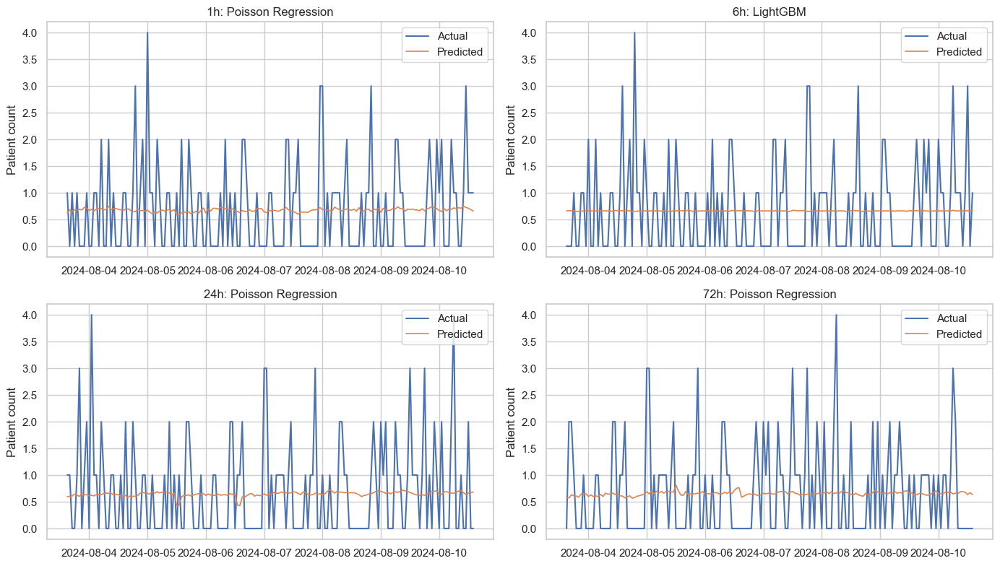

# Emergency Room Demand Forecasting

Emergency departments cannot staff safely from averages alone. Demand can spike by hour, day, weather pattern, and flu-season pressure, and underpredicting those spikes can leave teams short during the moments patients most need capacity.

This project builds a short-term forecasting workflow for ER patient arrivals in Los Angeles so hospital operations teams can anticipate near-term demand across 1h, 6h, 24h, and 72h planning horizons.

## At A Glance

| Area | Summary |
| --- | --- |
| Problem | Forecast short-term ER patient volume for staffing and patient-flow planning |
| Target | Hourly patient arrival count |
| Horizons | 1 hour, 6 hours, 24 hours, and 72 hours ahead |
| Data | Kaggle Hospital Emergency Room dataset plus weather and calendar features |
| Models | Baselines, Poisson/Ridge regression, compact SARIMAX, LightGBM or sklearn fallback |
| Validation | RMSE, MAE, zero-safe MAPE, bias, underprediction rate, and peak-period error |

## Why It Matters

The key operational risk is not only forecast error. It is forecast error in the wrong direction during busy periods. A model that underpredicts peak demand can contribute to understaffing, longer waits, and tighter patient-to-provider ratios.

For that reason, the notebook evaluates both statistical accuracy and staffing risk:

- How close are forecasts overall?
- Does the model systematically overpredict or underpredict?
- How often does it underpredict actual arrivals?
- What happens during peak-demand hours?
- Which hours or weekdays show the highest error?

## Forecast Snapshot

The figure below compares actual arrivals with the best available model for each forecast horizon on the test period.



## Results

The final model is selected separately for each horizon because immediate, shift-level, next-day, and 72-hour forecasts behave differently.

| Horizon | Best Model | RMSE | MAE | MAPE | Underprediction Rate | Peak MAE | Peak Underprediction Rate |
| --- | --- | ---: | ---: | ---: | ---: | ---: | ---: |
| 1h | Poisson Regression | 0.821 | 0.690 | 44.877 | 0.484 | 0.721 | 1.000 |
| 6h | LightGBM | 0.822 | 0.691 | 44.987 | 0.484 | 0.724 | 1.000 |
| 24h | Poisson Regression | 0.822 | 0.690 | 45.840 | 0.485 | 0.732 | 1.000 |
| 72h | Poisson Regression | 0.819 | 0.688 | 45.188 | 0.482 | 0.724 | 1.000 |

The strongest model is not always the most complex one. Poisson regression performs well for several horizons because hourly arrivals are low-count data with many zero-arrival hours, while LightGBM is useful for nonlinear interactions and performs best at the 6-hour horizon.

## Data

The project uses the [Hospital Emergency Room dataset](https://www.kaggle.com/datasets/xavierberge/hospital-emergency-dataset) from Kaggle.

The notebook expects raw data at:

```text
Notebook/data/raw/Hospital ER_Data.csv
```

If the raw file is missing, the notebook attempts to download it with the Kaggle CLI. Generated CSV files are ignored by git and can be recreated by running the notebook.

## Important Project Parts

| Notebook Section | What To Look For |
| --- | --- |
| Study Design | Defines the short-term forecasting problem and operational pressure signals |
| Data Ingestion & Integration | Downloads or reuses the raw ER dataset and aggregates encounters hourly |
| Data Cleaning & Quality Assurance | Validates timestamps, patient counts, wait times, admissions, and continuity |
| Exploratory Time-Series Analysis | Checks trend, seasonality, stationarity, decomposition, and autocorrelation |
| Feature Engineering | Builds calendar, flu-season, weather, lag, rolling, and cyclical features |
| Short-Term Forecasting Model Suite | Compares benchmarks, regression, SARIMAX, and tree-based models |
| Operations-Oriented Validation | Evaluates underprediction, peak-period error, and error by hour/day |
| Final Summary | Combines best-model metrics with operational risk indicators |

## Reproducibility

1. Configure the Kaggle CLI with your Kaggle API token.
2. Open `Notebook/main.ipynb`.
3. Run the notebook from top to bottom.

The notebook reuses `Notebook/data/raw/Hospital ER_Data.csv` if it already exists. Otherwise, it downloads the dataset and recreates the processed hourly, daily, weekly, monthly, weather, and modeling-ready files under `Notebook/data/`.

## Project Structure

```text
.
+-- Notebook/
|   +-- main.ipynb
|   +-- assets/
|   |   +-- forecast_vs_actual.png
|   +-- data/              # local raw and generated data, ignored by git
+-- project_outline.json
+-- Readme.md
+-- .gitignore
```

## Limitations And Future Work

This version is intentionally scoped to short-term ER arrival forecasting over 1h, 6h, 24h, and 72h horizons. It does not claim to complete medium- or long-term seasonal forecasting, LSTM modeling, or a formal staffing/wait-time simulation.

Useful next steps:

- Add stakeholder-defined staffing rules to translate forecast errors into coverage recommendations.
- Test LSTM or other sequence models once a stronger benchmark set is locked.
- Extend the workflow to weekly, monthly, and seasonal planning horizons.
- Validate the approach on additional hospitals or multi-site ER data.
